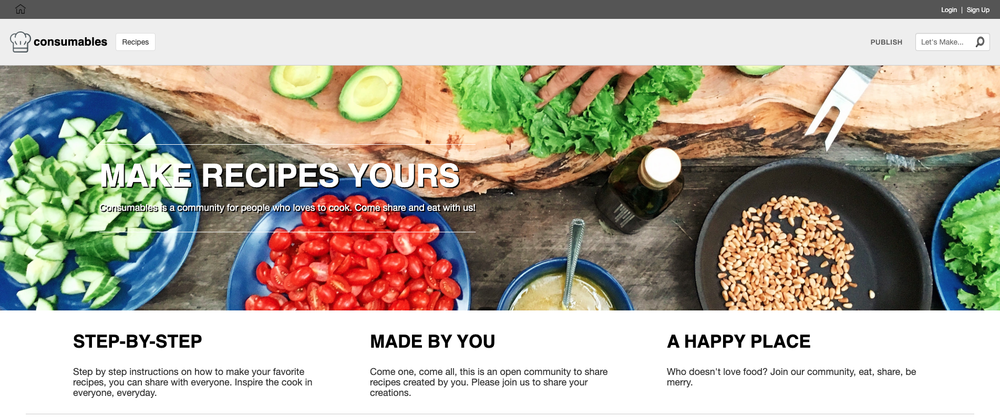
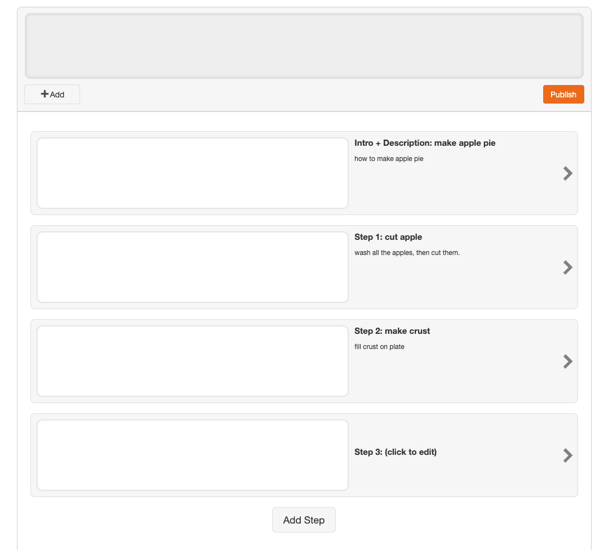

# Consumables 
<<<<<<< HEAD

    

=======

    

## Table of Contents
1. Introduction 
2. Technologies
3. Features
4. Future Directions

[Consumables](https://consumables-app.herokuapp.com/#/) is web application that allows anyone to share step by step instruction on how to make their favorite recipes and also see other recipes posted by other users. 

Link: https://consumables-app.herokuapp.com/#/

---

## Technologies 
This application uses:

* Ruby on Rails for the backend 
* React and Redux for the frontend user interface 
* Heroku for hosting
* Amazon Web Services (AWS) for the data storage

---

## Features 

CRUD!!!!! 

A user can create, read, update, and delete their recipes and it's associated steps.

    

---

## Future Directions

* upload images 
* searching

---

Discussion of technologies used
Delve deep into ~2 features that show off your technical abilities. Discuss both the challenges faced and your brilliant solutions.
Code snippets to highlight your best code (markdown code snippets, NOT screenshots)

>>>>>>> photos

## Table of Contents
1. Introduction 
2. Technologies
3. Features
4. Future Directions

[Consumables](https://consumables-app.herokuapp.com/#/) is web application that allows anyone to share step by step instruction on how to make their favorite recipes and also see other recipes posted by other users. 

Link: https://consumables-app.herokuapp.com/#/

---

## Technologies 
This application uses:

* Ruby on Rails for the backend 
* React and Redux for the frontend user interface 
* Heroku for hosting
* Amazon Web Services (AWS) for the data storage

---

## Features 

CRUD!!!!! 

A user can create, read, update, and delete their recipes and it's associated steps.

Create recipes:

    

Create Steps:

    

code snippet

    if (modal.includes("deleteStep")) {
        stepId = parseInt(modal.split("-")[1]);
        modalString = modal.split("-")[0]
    }

    let component, modalAction;

    switch (modal) {
        case 'open':
            component = <RecipeCreateFormContainer />
            modalAction = doNothing
            break;
        case "update":
            component = <UpdateErrorContainer />
            modalAction = closeModal
            break;
        case (modal):
            component = <ConfirmDeleteContainer stepId={stepId}/>
            modalAction = doNothing
            break;
        default:
            return null;
    }

One of the challenges I faced was trying to send dynamic data into my modal so I can delete different steps through a modal. My solution was to send the information as a part of the string to open the modal, and parse that string to get the specific data to be passed down as a prop into my modal component to give it the ability to delete a particular step.

    handleSubmit (e) {
        e.preventDefault();
        this.props.createRecipe(this.state)
            .then(() => this.redirectAndSubmit.call(this), () => this.errorTimer())
        
    }

Another challenge was the ability to do multiple functions upon success, and failure, so for both instances, the function has multiple functions nested. 

---

## Future Directions

* upload images 
* searching

